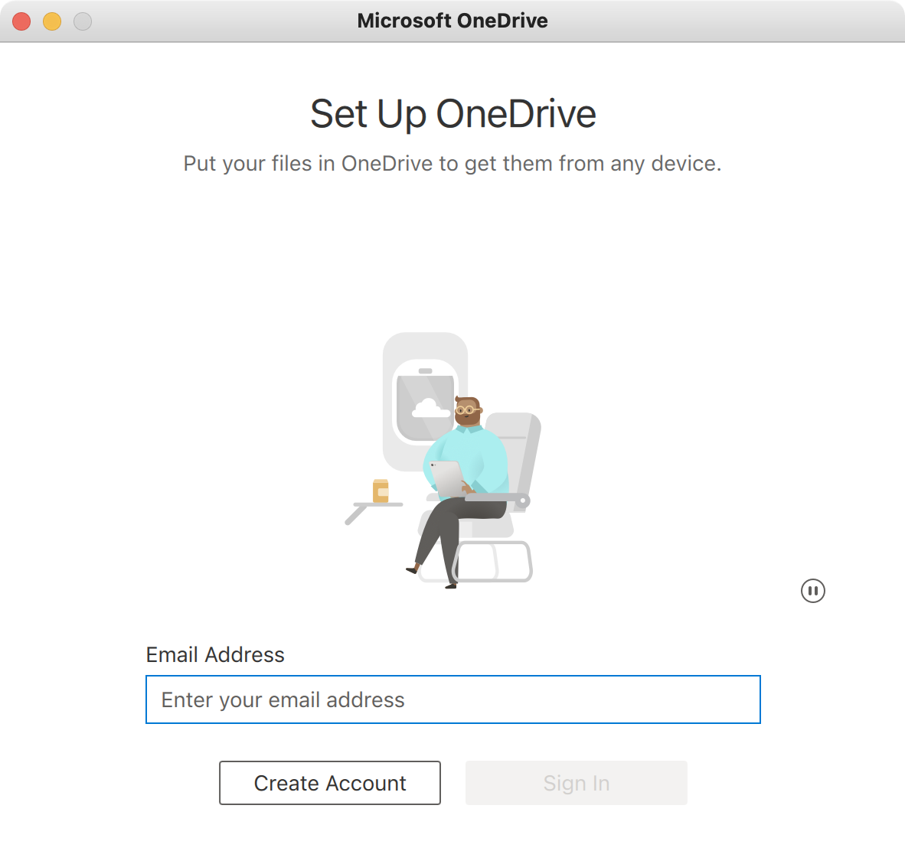

**Learning intentions**

- Set up your notebook with the necessary software
- Make sure all your school accounts are connected

**Success criteria**

You will know that you have completed this lesson's learning when:

- You have set up your school OneDrive
- You have downloaded and installed Python 3.10.2
- You have downloaded and installed Visual Studio Code
- You have configured Visual Studio Code correctly

--------

# Task 1.1: Set up your school OneDrive

In 12DTC, you will need to have access to your programs both at school and at home. The simplest way to achieve this is by using OneDrive.

## 1.1.1 Download OneDrive

Download OneDrive:
- for [Windows 10 and Windows 11](https://www.microsoft.com/en-nz/microsoft-365/onedrive/download) **only** if it is not already installed
- for [macOS](https://apps.apple.com/nz/app/onedrive/id823766827?mt=12) from the Mac App Store

## 1.1.2 Run OneDrive

On **Windows 10** and **Windows 11**:

- Click on the Start button (at the bottom-left of the screen) or press the Windows key on your keyboard
- Type "OneDrive"
- Click on the OneDrive icon

On **macOS**:

- Click on the Spotlight icon at the top right of the screen (it looks like a magnifying glass) or press Cmd-Space on your keyboard
- Type "OneDrive"
- Click on OneDrive

## 1.1.3 Sign in with OneDrive

When OneDrive opens, you should see a window like the one below:



- Enter your school email address ending in ``@student.onslow.school.nz``
- Click Sign In
- On the next screen, enter your password

After you have signed in and set up OneDrive, your files will sync to your notebook.

From this point onwards, make sure **all** your work is saved to OneDrive. If you save any files on the school computer or your network drive, you will **not** be able to access your work at home.

# Task 1.2: Set up Python

## 1.2.1 Download Python

In 12DIT, you will continue learning Python.

To use Python, you will need to download and install it on your computer.

Download Python 3.10.2:
- for [Windows 10 and Windows 11](https://www.python.org/ftp/python/3.10.2/python-3.10.2-amd64.exe)
- for [macOS](https://www.python.org/ftp/python/3.10.2/python-3.10.2-macos11.pkg)
- for Ubuntu Linux, use the [``pyenv-installer``](https://github.com/pyenv/pyenv-installer)

## 1.2.2 Install Python

For both Windows and macOS, double-click on the file that you downloaded in step 1.2.1.

For Ubuntu Linux, after you have installed ``pyenv``, open the Terminal app and run the following commands:
  - ```
    pyenv install 3.10.2
    pyenv global 3.10.2
    ```

# Task 1.3: Set up Visual Studio Code
## 1.3.1 Download Visual Studio Code

To edit your Python code, you will use Visual Studio Code. This is an integrated development environment that makes it easy to manage your Python files, test code, and get helpful suggestions when you're editing code.

[Download Visual Studio Code for Windows and macOS](https://code.visualstudio.com)

## 1.3.2 Install Visual Studio Code

For both Windows and macOS, double-click on the file that you downloaded in step 1.2.3.

Open Visual Studio Code on your computer. When you first open it, you will see a window like this:


# Task 1.4: Set up Git
## 1.4.1 Download and install Git

- Windows: [Download Git for Windows](https://git-scm.com/download/)
- macOS: Open the Terminal app and run the following command:
  - ```
    xcode-select --install
    ```
- Ubuntu: Open the Terminal app and run the following command:
  - ```
    sudo apt install build-essential
    ```

# Task 1.5: Set up Visual Studio Code

## 1.5.1 Set up extensions for Visual Studio Code


There are a few useful extensions for Visual Studio Code that can make programming a lot easier. Extensions give Visual Studio Code new features to improve the development experience.

- Click on the Extensions icon in the sidebar
  - It looks like a grid with a piece missing


In the search field at the top, search for and install these extensions:
- **Python** (by Microsoft)
  - Adds support for the Python language. This may already be installed.
- **Pylance** (by Microsoft)
  - Improved Python language support. This may already be installed.
- **Error Lens** (by Alexander)
  - Shows the line where coding errors are occurring as well as a hint on how to fix it
- **indent-rainbow** (by oderwat)
  - Shows your current indentation level using colours

## 1.5.2 Set up Visual Studio Code to use Python 3.10.2

- Click ``View menu → Command Palette…`` or press F1 (Windows) or Cmd-Shift-P (macOS) to show the Command Palette.
  - A text box will show at the top of the screen. 
  - Type "select interpreter". You will see an option called "Python: Select Interpreter" in the menu. Click on it.
    - 
  - Click on the option for Python 3.10.2
    - 

## 1.5.3 Set up Settings Sync in Visual Studio Code

- Show the Command Palette (instructions in 1.2.5)
- Type "settings sync"
- Click on "Settings Sync: Configure"
- Click OK

- Click to sign in with your Microsoft account
  - Use your school email address and password to log in
  - Do **NOT** use your personal email address

If you use Visual Studio Code on a different computer, you will be able to repeat this process on it to use the same settings for all your computers.